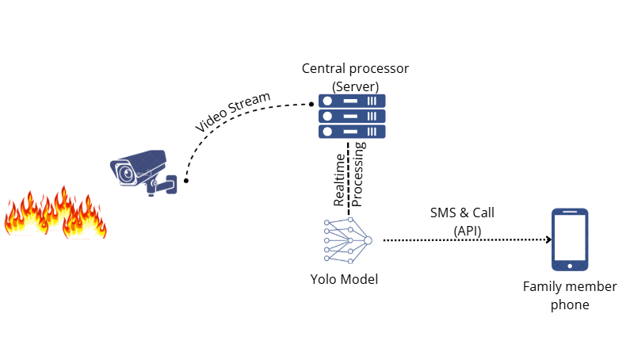
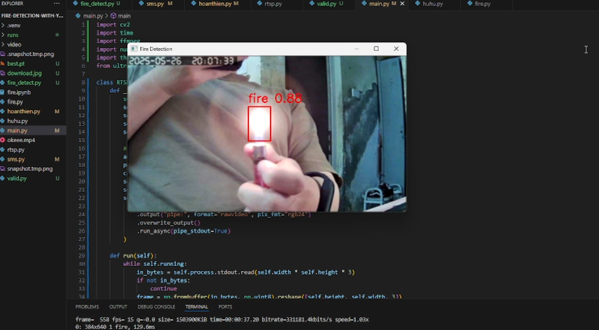

# Fire Detection with YOLOv8

## Description
The **Fire Detection with YOLOv8** project implements a fire detection system using the YOLOv8 model from Ultralytics. The system integrates IP cameras via the **RTSP** protocol for real-time monitoring and sends SMS alerts when a fire is detected through the [Android SMS Gateway](https://github.com/capcom6/android-sms-gateway). The project is suitable for applications such as safety monitoring, wildfire tracking, or automated fire alert systems.



## Features
- Inference on images, videos, webcams, or RTSP streams from IP cameras to detect fires.
- Display results with bounding boxes around detected fire regions.
- Integration with IP cameras using the RTSP protocol for real-time monitoring.
- Sending SMS alerts when a fire is detected via [Android SMS Gateway](https://github.com/capcom6/android-sms-gateway).
- Support for customization to improve performance on different data sources.

## Requirements
- Python 3.8+
- Ultralytics YOLOv8 library
- OpenCV (`opencv-python`) for processing RTSP streams and webcams
- NumPy
- `requests` library for communication with Android SMS Gateway
- Android device with the **Android SMS Gateway** application installed and configured
- IP camera supporting the RTSP protocol

## Installation
1. **Clone the repository**:
   ```bash
   git clone https://github.com/23hoangkt/fire-detection-with-yolov8.git
   cd fire-detection-with-yolov8
   ```

2. **Set up the environment**:
   Create a virtual environment and install required libraries:
   ```bash
   python -m venv venv
   source venv/bin/activate  # Linux/MacOS
   venv\Scripts\activate      # Windows
   ```

3. **Configure IP camera (RTSP)**:
   - Obtain the RTSP URL from the IP camera (typically in the format: `rtsp://username:password@ip_address:port/stream`).
   - Update the RTSP URL in the `config.yaml` file or directly in the code (e.g., `fire_detect.py` or `sms.py`).
   - Ensure the IP camera and the system are on the same network or configure the network appropriately (e.g., open port 554 for RTSP).
   - Test the RTSP connection using a tool like VLC or the command:
     ```bash
     python rtsp.py
     ```

4. **Configure Android SMS Gateway**:
   - Download and install the Android SMS Gateway application from the [repository](https://github.com/capcom6/android-sms-gateway).
   - Run the application on the Android device and note the API URL (default: `http://<device-ip>:8080`).
   - Update the API information (URL, recipient phone number) in the `config.yaml` file or directly in the code (e.g., `sms.py`).
   - Ensure the Android device is connected to the same network as the system.

## Usage
### 1. Detection on images/videos/RTSP streams/webcams
Detect fires on images, videos, webcams, or RTSP streams from IP cameras:
- **On images**:
  ```bash
  python valid.py 
  ```
- **On videos or webcams**:
  ```bash
  python fire_detect.py 
  ```
- **On IP cameras (RTSP)**:
  ```bash
  python main.py 
  ```

### 2. Sending SMS Alerts
When a fire is detected, the system automatically sends an SMS via Android SMS Gateway:
- Run the system with IP camera integration and SMS alerts:
  ```bash
  python sms.py 
  ```
- Ensure the Android SMS Gateway application is running and the API URL is correctly configured in `sms.py`.

### 3. Results

## Contribution
We welcome all contributions! To contribute:
1. Fork the repository.
2. Create a new branch: `git checkout -b feature/feature-name`.
3. Commit changes: `git commit -m 'Add feature XYZ'`.
4. Push to the branch: `git push origin feature/feature-name`.
5. Create a Pull Request.

## Contact
If you have questions or need support, please open an issue on GitHub or contact via email: [hoangkimtruong2003@gmail.com].

